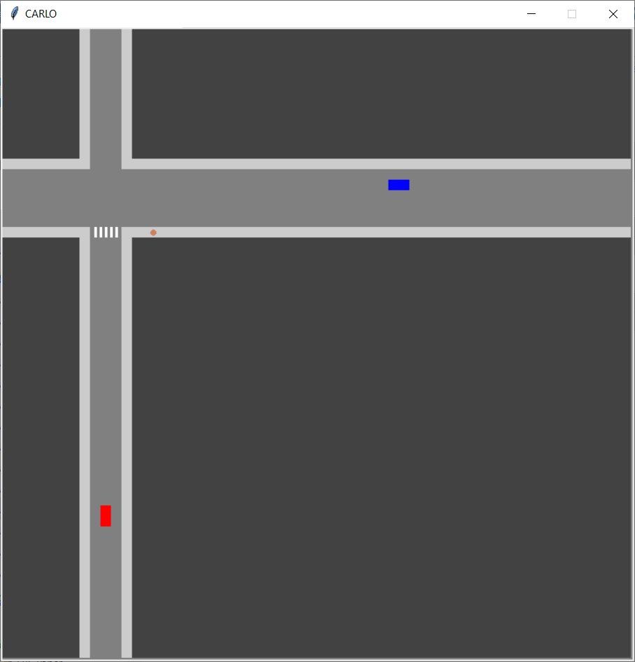
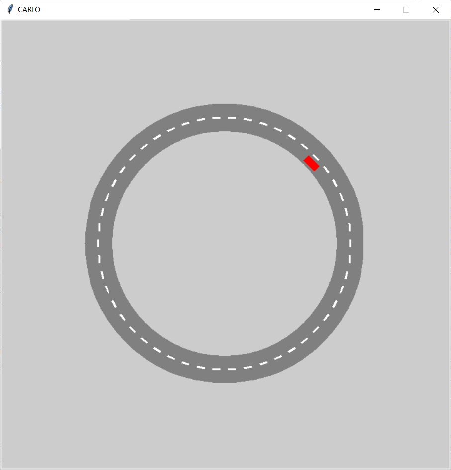

# CARLO
2D Driving Simulator

CARLO stands for _[CARLA](http://carla.org/) - Low Budget_. CARLO is definitely less realistic than CARLA, but it is much easier to play with. Most importantly, you can easily step the simulator in CARLO, and it is computationally much lighter.


## Dependencies
You need to have the following libraries with [Python3](http://www.python.org/downloads):
- [NumPy](http://www.numpy.org/)
- [TkInter](http://wiki.python.org/moin/TkInter)
- [pygame](https://www.pygame.org/) (required only for Steering Wheel controller)

## Running
Simply run
```python
	python example_intersection.py
```
or
```python
	python example_circularroad.py
```
for simple demos. The former has an example of how to use Steering Wheel controller (only Logitech G29), and the latter shows how to use Keyboard controller. You can also have a look at these files to understand how to customize your own environment. It is very straightforward.

## Features
CARLO currently supports Cars and Pedestrians as the dynamic objects. They both use bicycle dynamics. The point-mass dynamics are commented out in the code.

It also supports Buildings and Paintings, which are useful mostly for decoration purposes (e.g. sidewalks, zebra crossings, etc).

Collision dynamics are not implemented, but CARLO has methods that can check whether or not there exists a collision between two objects.

There are many hidden features right now. We will reveal them as we start writing a documentation.

## Contributing
Feel free to contribute to the code and/or initiate issues for problems and questions.

## Paper citation
If you used CARLO for your experiments, consider citing the following paper:

<pre>
@inproceedings{cao2020reinforcement,
  title={Reinforcement Learning based Control of Imitative Policies for Near-Accident Driving},
  author={Cao, Zhangjie and Biyik, Erdem and Wang, Woodrow Z. and Raventos, Allan and Gaidon, Adrien and Rosman, Guy and Sadigh, Dorsa},
  booktitle={Proceedings of Robotics: Science and Systems (RSS)},
  year={2020},
  month={July}
}
</pre>